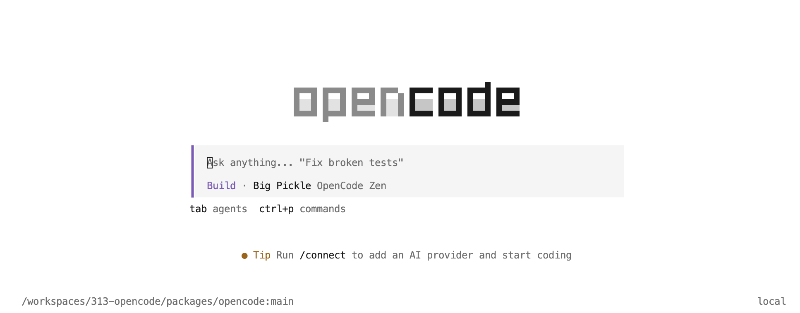

# Project 1A: Build Checkpoint

## Deliverables

**Build Checkpoint** – 5 points – due Monday, August 31st, 11:59pm

## Getting Started

### Repository Setup

Fork the [class-specific repository](https://github.com/CMU-313/opencode) into your personal GitHub account.
After forking, ensure **GitHub Actions** are enabled for your fork by clicking the green button under the **Actions** tab.

!!! warning
	Even though this project is based off of an active open source project, we have made significant changes to ensure its suitability for our class.
	As such, be sure you are forking off of **CMU-313/opencode** and direct any questions to [course staff](https://cmu-313.github.io/#staff).
	Do **not** contact the maintainers of opencode for assistance with your homework questions.

### Development Environment

Your first step should be setting up a **VS Code DevContainer**.  

It gives you a fully configured environment and makes it easier for the course staff to help you.
You'll know it's working once VS Code finishes connecting: look for a green indicator in the bottom-left corner of the window that starts with **Dev Containers: ... **.
You can find support online on how to setup and run a DevContainer. You may also ask the TAs for help with configuration.  


#### Prerequisites

- [Docker](https://docs.docker.com/get-docker/)
- [Visual Studio Code](https://code.visualstudio.com/) with the [Dev Containers extension](https://code.visualstudio.com/docs/devcontainers/tutorial)
- [Ubuntu WSL2](https://learn.microsoft.com/en-us/windows/wsl/setup/environment#get-started) (if using Windows)

!!! note "What is Docker?!"
	You may be overwhelmed by the presence of this (maybe) unfamiliar tool, or maybe just curious about its functionality. Do not fear! We have put together a [Development Tools Guide](https://cmu-313.github.io/projects/P1/development-tools-guide/) where we cover the basics of Docker and other tools used for this project!

#### Installation

1.	Clone your fork to your machine.
	If you are using Windows, you should use `git` from inside **WSL2**.
	```bash
	git clone https://github.com/<your-username>/opencode.git
	cd opencode
	```

	!!! warning "Windows WSL2 Warning"
	    For Windows WSL2 users, you should [**store your project files on the same operating system as the tools you plan to use**](https://learn.microsoft.com/en-us/windows/wsl/filesystems#file-storage-and-performance-across-file-systems). When it comes to cloning the opencode repository, it means that you should clone it in:

	    - the Linux file system root directory: `\\wsl$\Ubuntu\home\<user name>\`
	    - **NOT** the Windows file system root directory: `/mnt/c/Users/<user name>/$` or `C:\Users\<user name>\`

	    You can use `% cd ~` to access the Linux home directory, then clone the repository there.

2. 	In your development environment, you will install dependencies from the repo root:

  ```bash
  bun install
  ```

#### Launch

After you have installed the dependencies, you can run it using the command:
  ```bash
  bun dev
  ```

When you run it properly, you will see something that looks like the following: 




#### Lint and Test

When working on an existing codebase, especially in a collaborative setting, we want to ensure that none of our changes introduce unexpected bugs or issues for other developers.
To fulfill these goals, we often use different tools to help us evaluate our code.

You can run the linter using the following command:

```shell
bun lint
```

Opencode is configured to not run the entire test suite all at once.  You should run the tests package by package. 
You can run the tests by running 

```shell
bun test
```
from inside a package dir.  It will run different tests depending on which package you run it from.


```shell
bun test --coverage
```

After the test suite finishes running, opencode will also generate a **code coverage report**.
This report gives you measurements with regards to what percentage of the codebase is covered by the test suite.
Open the `index.html` file in the `coverage` folder to see the full report.

!!! note "Coverage Report"
	As this is an existing codebase with a decently-sized test suite, you should expect to see a relatively **high percentage of coverage**, i.e. the majority of the bars/cells displayed should be green.

	If you are seeing **a lot** of red bars, it may mean that the test suite was not run properly.
	Double-check that all of the tests passed and that there were no failures.

??? info "More on Analysis Tools"
	A **linter** is a tool that directly analyzes your source code for common errors.
	A **test suite** is a set of test cases that you write for a software program to show that it has some specified set of behaviors; our **testing tool** provides a framework to structure our test cases, runs the test suite, and generates a report of which tests pass/fail.

	We will do a more in-depth exploration of analysis tools later in the course.
	For now, just know that these tools exist for you to use in evaluating your code.

## Deliverable: Build Checkpoint (5 pts)

Upon completing the above steps, take screenshots of

- your vscode which shows opencode running in a development container 
- the coverage report generated by the coverage tool


Submit the two screenshots to [Gradescope]({{ gradescope_course_url() }}).

## Grading

To receive full credit for this checkpoint, we expect:

- [ ] A Gradescope submission of two screenshots showing a local running build of opencode running in a development container and the coverage report within a browser
