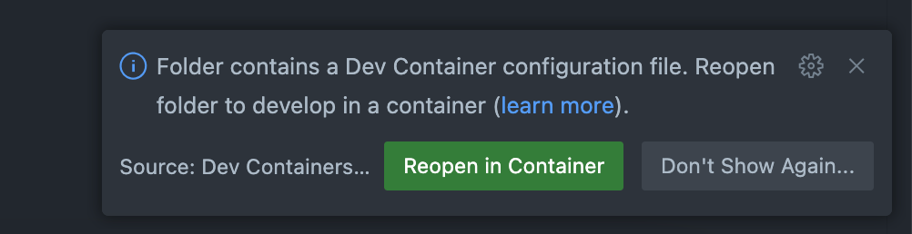

# Development Container Installation Instructions

For this class, you should be using a VSCode Development container to run OpenCode. **Please take the time to carefully read through the instructions!**

First, follow the instructions for [installing Docker](https://code.visualstudio.com/docs/devcontainers/containers#_installation) on your respective operating system.

Once you have Docker for desktop installed, follow along with the [tutorial](https://code.visualstudio.com/docs/devcontainers/tutorial) for setting up Docker and development containers in VScode.

Once you have set up Docker and devcontainer extensions properly, you should be able to replicate the example in the tutorial smoothly.

You're now ready to go! Start by creating a `devcontainer.json` file in your root repository and write your container from there. Good luck!

Once you're done, you should be able to see a box prompting you to reopen the repository in a development container every time you open VScode.

