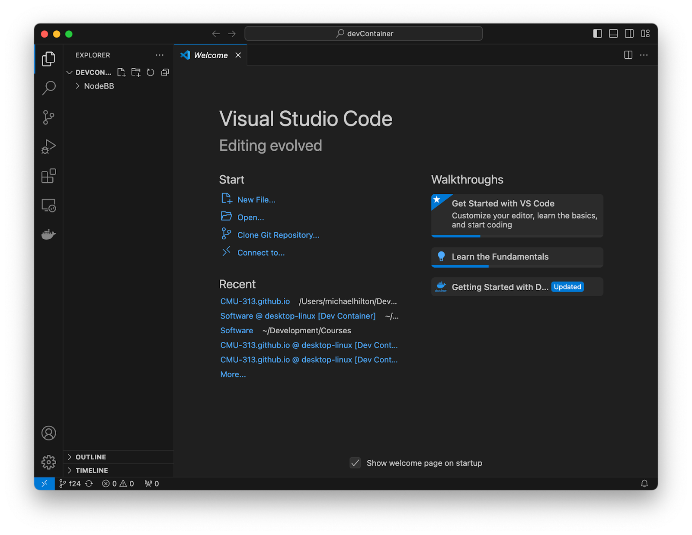
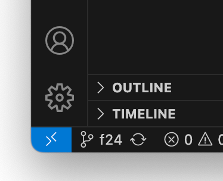
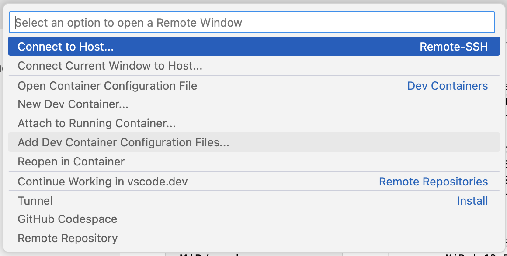
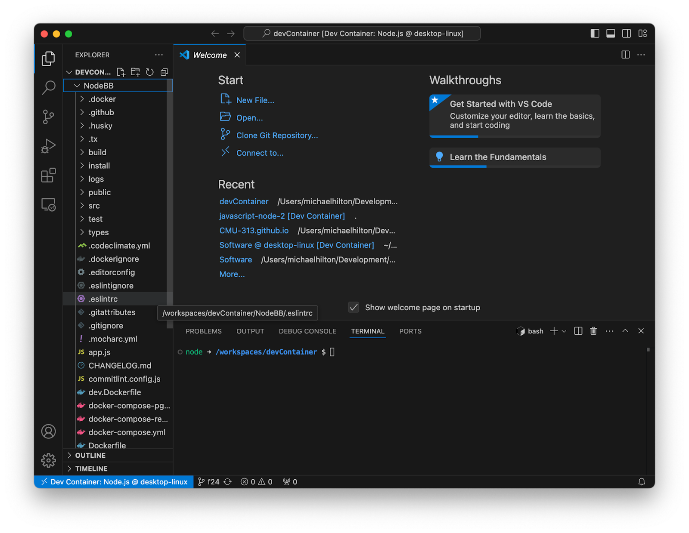
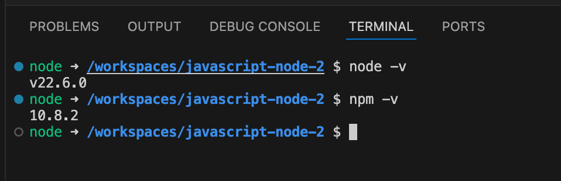

# Development Container Installation Instructions

You might want to consider running NodeBB in a VSCode Development container. 

These are step by step instructions on how to configure a development container on a Mac, more documentation for Windows is available here:

[https://code.visualstudio.com/docs/devcontainers/containers](https://code.visualstudio.com/docs/devcontainers/containers)

First, You should follow the instructions here to install docker and development containers for vscode:

[https://code.visualstudio.com/docs/devcontainers/tutorial](https://code.visualstudio.com/docs/devcontainers/tutorial)

When you are done, you should be able to run the example in that tutorial.

After that, 

Clone the repo from your fork of the class repository:

```console
> git clone git@github.com:CMU-313/NodeBB.git

Cloning into 'NodeBB'...

remote: Enumerating objects: 280535, done.

remote: Counting objects: 100% (1389/1389), done.

remote: Compressing objects: 100% (1237/1237), done.

remote: Total 280535 (delta 135), reused 1304 (delta 122), pack-reused 279146 (from 1)

Receiving objects: 100% (280535/280535), 83.62 MiB | 12.54 MiB/s, done.

Resolving deltas: 100% (222305/222305), done.
```


Next, open the directory you just created with vscode. You can do this in the UI, but if you have launching from the command line enabled ([https://code.visualstudio.com/docs/setup/mac](https://code.visualstudio.com/docs/setup/mac)) then you can use the command: 

Command: code .

This should open vscode as such: 



If you followed the tutorial correctly, you will see a blue square in the bottom left corner:




Click on that, and it will open this menu:




From there, choose “Reopen in Container”

It will take a little while for that to run, then it should restart VSCode and you will see this in the bottom left:


Now go to the menu, and select 

Terminal -> New Terminal




Now you will see an integrated terminal window.  You should be able to check the node version and npm version also:




Now you have access to the NodeBB files, but you should follow the Linux instructions, **EVEN IF YOU ARE RUNNING ON A MAC OR WINDOWS COMPUTER.**
