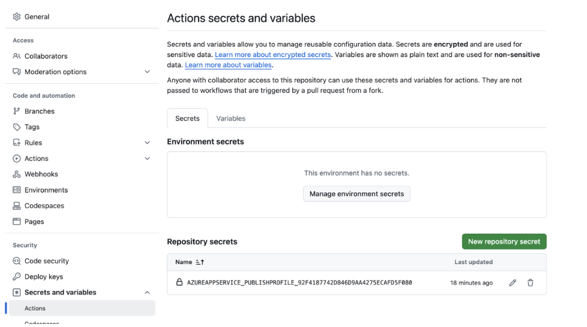

# Serverless NodeBB Deployment on Azure

This document will provide instructions to create a serverless deployment of NodeBB on Azure.

## Initial Setup

1. Visit [Azure](https://azure.com) and create an account using your school email address.
2. There will be a wizard which will ask questions, you can select “skip” if you want.
3. Once you are done, you should see the home screen:
   
4. Select "Subscriptions", and you should see a subscription from your TA. For all resources created in this class, use this subscription.
   

## Create a Redis Instance on Azure

1. Go back to the Azure homepage. Click "Create new Resource". Search for "Azure Cache for Redis" and select it. Make sure it is the one with the Blue logo provided by vendor "Microsoft", and not one of the third-party services. It should look like this: 
2. When creating the resource, use the lab subscription you created above. For "Resource Group", if nothing exists already, just create a new one called "P3".
3. DNS Name: Use `<team_name>-db` or something similar. This will also be the "resource name" that you will see at the homepage/dashboard later so make sure to name it something that you can identify later as being the Redis instance for your team.
4. Cache size: Select the lowest available (e.g. Standard C0 - 250 MB)
5. Next—Networking: Make sure "Public Endpoint" is selected so that you can connect to the instance from outside of Azure.
   
6. Next—Advanced:  
   a. Enable the "Non-TLS port" option so that you can connect to the instance via port 6379.
   b. Under "Authentication", disable Microsoft Entra and enable "Access Keys". 
7. Next—Tags: Ignore this page. Move forward.
8. Next—Review + Create. You should have the same options as listed below: 
9. Create the instance! Wait for several steps of creation and initialization (can take several minutes) before the instance appears available from the Azure Dashboard.
10. Test the Redis instance: Go to the resource page for your Redis resource and note the host name. It should end with ".redis.cache.windows.net". You should also see "Port 6379 enabled" and a link to "Access keys" (which you can also get to by navigating to the "Authentication" tab). From here, copy either the primary or secondary access key.  Then, in your terminal on your laptop, type `redis-cli -h <host-name-ending-in.redis.cache.windows.net> -p 6379 -a <access_key>`. You should be able to login to the redis instance and get a command-line interface. You should see a prompt with the hostname and port number, and you can type commands like `info` to get instance info. Type CTRL+D to exit the redis-cli.

### **Troubleshooting**

If your Redis resource seems to be up on the Azure dashboard but you are not able to connect to it via the CLI, check some of these things in the CLI:

- **Is public networking enabled?** Check "Settings > Private endpoint." If you see private endpoints, then you need to delete them and add public access via the buttons on this screen.
- **Is port 6379 (the non-SSL port) enabled?** Check "Settings > Advanced Settings > Access only via SSL," which should be set to "No."
- **Did you copy the right access key?** See the screenshot above for reference.

## Create a Web App

1. From the Azure dashboard, select "Create Resource" and choose "Web App". Choose the same Subscription and Resource Group as above.
2. Basics:  
   a. Choose a web app name, e.g. `nodebb-<team_name>` (the suffix will be `.azurewebsites.net`). Make sure to disable "Try a unique name" so you don't get a long hash in the name.  
   b. For Runtime stack, choose "Node 20 LTS".  
   c. For Region, the default might be “Canada Central”, which is fine.  
   d. For "App Service Plan" / "Pricing Plan" choose "Basic B1"
3. Next—Deployment:  
   a. **Enable basic authentication. Make sure to scroll down to the bottom of the page and enable this before doing the next step (at the top of the page).** 
   b. Scroll back up and enable "Continuous Deployment" via GitHub, and link to your GitHub account and choose the team repo you are working on. You will need to give Azure access to your GitHub account. You can optionally skip this step if you are confident about configuring CI separately later on manually.  
   c. NOTE: The repository name is your team’s repository 

4. Next—Network: Defaults should be fine. Just make sure public access is ON.
5. Next—Monitor & Secure: You can disable App Insights to avoid this extra billing.
6. Next—Tags: Ignore, just move forward.
7. Review+Create. Make sure you are on the Basic B1 plan (about $12.41 USD/month). Confirm all details and create. This will again take some time to create.

## Setup CI via GitHub Actions

1. From the Azure dashboard, go to the resource page for your Web App created above.
2. Navigate to the "Settings > Configuration" tab from the sidebar and in the start-up command type `node app`. Save this setting. 
3. Navigate to the "Deployment > Deployment Center" tab from the sidebar. Configure the deployment to build from source: GitHub and make sure it is connected to your repository (Org/Repo/Branch) as above.  
   a. **If your Deployment center is already connected to your repository, then you can go to the next step.** If it is not connected, then For "Workflow Option", choose "Use Available Workflow". We will use the Azure Deploy workflow already in the CMU-313/NodeBB repo. This workflow deploys to Azure, but it depends on several secret variables like `ADMIN_PASSWORD` (for your NodeBB admin user), `REDIS_HOST`, `REDIS_PASSWORD` (for your database), and `AZUREAPPSERVICE_PUBLISHPROFILE_XXX` (for allowing GitHub to deploy to your Azure instance). Save these changes.
4. Now let's set up these secret variables on GitHub.com.  
   a. Go to your team's NodeBB repository and navigate to Settings > Secrets and Variables > Actions. You should already see a secret called `AZUREAPPSERVICE_PUBLISHPROFILE_XXX` which Azure put there when you linked your GitHub account and created the web app resource. 
   b. Use the "New repository secret" button three times to create three secrets needed for your workflow:

      i. **ADMIN_PASSWORD**: Choose something easy to remember.
      
      ii. **REDIS_HOST**: Put the full domain of your Redis cache instance in the form `<name>.redis.cache.windows.net`.
      
      iii. **REDIS_PASSWORD**: Put the secret access key (either primary or secondary) for your Redis cache instance, which is the same one used to connect via CLI. It can be accessed from the "Authentication" tab in the Redis resource page on Azure.

5. Delete the .yml file that was committed by Azure. It might be named something like: `.github/workflows/f24_nodebb-<teamname\>.yml`
6. Finally, edit the workflow file `.github/workflows/azure-deploy-f24.yml` in your own repository and modify four lines:  
   a. Edit the [name of the repository](https://github.com/CMU-313/NodeBB/blob/e7cfda55ca93beae87c8cce4407ca6c84c8cd739/.github/workflows/azure-deploy-f24.yml#L22) to match your repository name from GitHub. This guard is used here so that forks of the repo don't accidentally trigger deployments to the wrong target hostname.  
   b. Edit the [NodeBB setup URL](https://github.com/CMU-313/NodeBB/blob/e7cfda55ca93beae87c8cce4407ca6c84c8cd739/.github/workflows/azure-deploy-f24.yml#L37) to match the domain where your web app will be deployed. You can get this from the Overview page of the Web App resource on Azure; it should be of the form `<name>.azurewebsites.net`. Make sure that the workflow file retains the `https://` prefix and the `:443` suffix around the domain.  
   c. Edit the [app name](https://github.com/CMU-313/NodeBB/blob/e7cfda55ca93beae87c8cce4407ca6c84c8cd739/.github/workflows/azure-deploy-f24.yml#L51) to the <name\> part, which is the name of your app on Azure.  
   d. Edit the [name of the publish profile secret key](https://github.com/CMU-313/NodeBB/blob/e7cfda55ca93beae87c8cce4407ca6c84c8cd739/.github/workflows/azure-deploy-f24.yml#L53C40-L53C70) to match the name of the secret key in your settings, as shown above. Azure auto-generates the name of this variable with a unique suffix, so we have to keep updating this one.
7. Commit and push to GitHub to trigger the Actions workflow and Azure deployment.

## Monitoring the Deployment

- On GitHub, you should see a dot next to the commit that shows you the status of the action. This may take a couple of minutes to complete. If the action fails, you can view the logs to see what went wrong (e.g. bad configuration or failed a lint/test).
- On the Azure dashboard, you can go to the Web App resource page, navigate to the Deployment Center tab from the sidebar, and view logs. You should see a log entry after every GitHub Action that succeeds its deployment. It can take 20-30 minutes for the deployment. If something goes wrong, you can navigate to the "Log Stream" page in the sidebar of your Web App resource. This should give you the stdout stream for the NodeBB setup and run, just like you would see on your own command-line if you ran `./nodebb setup` and `./nodebb start` locally. This can help you debug issues with wrong configuration, etc. if you missed any of the steps above.
