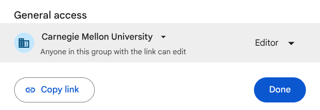

# Project 4A: Design, Test, and Implement

## Basic LLM Experiment (15 points)

To explore the feasibility of LLMs for this task, your manager would like you to prototype the basic functionality of an LLM to translate text. Due to the company’s financial situation, your team will be deploying an open model of your choice running locally on the company's servers.

Once you're all set up, open the Colab notebook using [this link](https://colab.research.google.com/drive/1k4qETwMN5SbIfhbHk6stkhOGhoBoi3ae?usp=sharing). Click on File --> Save as a copy in Drive to create your own copy that you will work on. Only one team member needs to do this, and the team should collaborate using this notebook. Click on Share and make sure the Colab notebook is **editable** by anyone in Carnegie Mellon University. Your permissions should look like this:

Now, you should be ready to experiment with Ollama! Follow the instructions in the notebook through the end of the Basic LLM Experiment.

Given the unpredictable nature of LLM responses, it is crucial to test whether your application can handle a range of outcomes. Your Colab notebook should also include tests for your code. We have provided some starter code for this.

In this task, you are required to employ mocking techniques to test your code resilience against unexpected results from API calls to the LLM. Mocking is a method used in testing to replace real system components with mock objects that simulate the behavior of those components. This approach allows developers to emulate various scenarios, including errors or atypical responses from external services, without having to make actual API calls. Here you will be using mocking to mimic different unexpected outcomes to check if your code can handle such anomalies gracefully.

For full credit, your submission should have at least four mock tests that deal with different unexpected model behaviors. At least one of these tests should involve the model returning unexpected text. All tests should relate to the `query_llm_robust` function.

You should download and submit a .ipynb copy of your Colab notebook (with outputs) to Gradescope.

## Architectural Design Document (40 points)

Now that you've demonstrated the LLM translation feature working in isolation, your manager has requested a concrete design document outlining (a) how you plan to integrate the new LLM-powered translation feature into NodeBB's existing codebase, and (b) the best model and prompt to use. One of your manager's requirements is that this feature should work on a deployed site.

If the team decides to go ahead with the feature, this design document will be followed in order to fully integrate this feature into NodeBB. 

After that, we want to see information about how you plan to integrate this translation feature. We would like to see details here **specific to implementing this within the NodeBB architecture**. Draw on your previous experiences working in this project and the development tools you've learned how to use!

Once you have finished evaluating the codebase, create a design document highlighting your findings and decisions. Below is a sample outline for your design document; we expect this to be **around 1,000-1,500 words** (no more than 2,500 as a hard cap; your boss is a busy person, and appreciates conciseness). We have also provided a Google Docs template [here](https://docs.google.com/document/d/17UWAdL9agJsP2kqgCmFZ4ssZHCH5WnI1Z3xsR-p6qXo/copy?usp=sharing) for you to copy and fill in with the necessary information. Also important to note: we would like for *everybody* on the team to contribute to this document; there will be a section where we will ask for each teammate to fill out what they did on this document. Please additionally write this on a Google Docs; we will ask you to share the link via Gradescope. Make sure you specify that **everybody at CMU with the link has edit access**; if we have reason to suspect that anybody has not done what they claimed, we will check the edit history of the document.

This is what you should include in your design document:

1. **Authors:**
  At the top of the document, each teammate should specify what part of the design document they contributed to.
2. **Problem:**
  You should describe what the problem you are trying to solve with this feature.  NOTE: this problem definition should be used to help define what the Definition of Success is.
3. **Feature Overview:** 
  Describe concisely how the translation feature works and how it will be used by the relevant stakeholders, with screenshots if necessary.
4. **Implementation Plan:** 
  Explain how you plan to integrate the LLM into the NodeBB architecture as specifically as you can. Include a diagram and explanation of your solution. 
  We'll give you an example of a different project to show you the level of detail we're looking for: integrating this with the CMU directory to populate users with their corresponding photo based on their Andrew ID (let's assume this is their username in NodeBB). To integrate this as a microservice NodeBB interacts with, this could be done by rewriting the API request when a user is created (a POST request to `/user`; details about this request are in `public/openapi/write/users.yaml`). We reach out to the CMU directory microservice and query the username that is passed in; if we are able to find it, we update the user metadata (`data`) in the `create` function within `src/user/create.js`. This could also be done by listening for the event that is fired when creating an event (`action:user.create`), and adding these additional attributes after that point. 
  `Ctrl-Shift-F` is your friend here; if you're struggling, look back at [lecture 2](https://cmu-313.github.io/assets/pdfs/02-archaeology.pdf) to get some tips on how to work through NodeBB's codebase.
5. **Quality Requirements:** 
    Additionally provide a concise, prioritized list of the overall quality requirements you considered in arguing for the integration of the feature into the system and a short justification for each. Your team should decide on **at least three** requirements to focus on. 
    Rank your requirements in decreasing order of importance. This allows readers to quickly understand what you were designing for.
6. **LLM Integration Plan:** 
    This section of the document discusses the specifics of the LLM you will implement.
    1. **Potential Solutions**
    Your team should consider **<number of people in your team>** different models to use in the new feature. Test the pros and cons of each of these models using your Colab notebook, on top of cross-referencing with resources online (such as benchmarks) to find what would be the best possible model for your use case. You may also test out different prompts as well. **Each teammate** should run the Colab notebook on a different model and record their results in this design doc. 
    For each model, provide a brief description of the model's design (how many parameters, its features, licensing, etc.), your results when testing the model, and a discussion of the design's tradeoffs.
    2. **Selected Model + Justification**
    Describe which model and prompt your team decided to proceed with using in your LLM. Justify your design decisions, including why your design is adequate for the quality attributes important to this system, and what assumptions you made in your design (if any).
7. **Definition of Success:** 
    Describe in detail how you will know when you are done (aka what is your definition of success).  Describe what it will look like when you are done, and how you will know when it is correct enough to be done. Describe specifically how you will evaluate your solution.  You might need to use different techniques to evaluate different parts of the solution.

!!! warning On Generative AI
    In the past, we have had problems with students using generative AI tools to generate low quality text. For this assignment, we will be evaluating each contribution to the document individually.  You are not responsible for fixing other teammates' text. However, you should clearly indicate at the top of the document who was responsible for each part of the dcoument. Low quality AI slop will result in signficant penalties for the student who contributed that section.

By the checkpoint deadline, your team will submit your design document to Gradescope as a Google Docs link.

## LLM Experiment Integration Checkpoint (10 points)

For this checkpoint, you are expected to have successfully integrated the provided UI code into your project. Additionally, you must implement and deploy a server-side functionality that returns a hardcoded response. This step is crucial to ensure you are on track. We have provided some initial code on [this repo](https://github.com/CMU-313/translator-service).

Furthermore, your server-side code must include unit and mock tests. To accomplish this, you must move the tests you wrote in the previous checkpoint to the repo and integrate them into the CI pipeline.

## Grading
To receive full credit for the first checkpoint, we expect:

- [ ] An Google Doc design document that highlights your findings and decisions.  This should follow the outline, and be around **around 1,000-1,500 words**.  It should not include low-quality AI slop in the text.
- [ ] A link to your Colab notebook completing all of the setup and basic LLM experiment steps outlined by the previous section
- [ ] A functional integration of the UI code into your NodeBB application.
- [ ] A preliminary implementation of the translation feature using the starter code, including CI with unit and mock tests.

## Resource & Documentation

### Design Documents
The design document task is easy to underestimate both in terms of time needed and in terms of difficulty designing meaningful and useful descriptions. While it is easy to create a superficial solution, a good solution will likely require significant thinking, discussion, and iteration.

Feel free to seek feedback from the course staff on your solution before submission!

There are a few additional reference materials available in the CMU library that your team may want to consult. We do not recommend reading through all of it; instead, skip around to sections that are relevant to you.

- [Software Architecture in Practice, Third Edition](https://resources.sei.cmu.edu/library/asset-view.cfm?assetid=30264): You may wish to review appropriate sections within Part Two to help find appropriate tactics and techniques you can use in your design to promote particular quality attributes.
- [Documenting Software Architectures: Views and Beyond, Second Edition](https://resources.sei.cmu.edu/library/asset-view.cfm?assetid=30386): Useful book to generally reference for creating architecture documentation.

