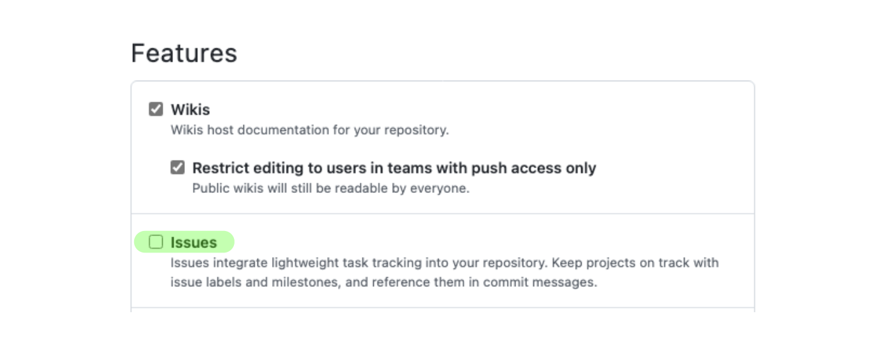

# Recitation 1: Using Git & Github for Collaborative Development

## Overview
After this recitation, the students should be able to use Git and GitHub for their teamwork in this course and other projects. Students should know about the GitFlow workflow and how to collaborate with other developers in their projects.

## Prerequisites
- [x] You have a [GitHub](https://github.com/) account
- [x] You have [Git](https://git-scm.com/downloads) installed
- [x] You have [Python 3](https://www.python.org/downloads/) installed
- [x] You know [Git Basics](https://rogerdudler.github.io/git-guide/)

**You will be doing the activities as pairs, so be sure to find a partner! Unless specified, each step is to be done by both people.**

## Activity 1a: Forking a repo and adding a collaborator
- Have either you or your partner fork [this repository](https://github.com/CMU-313/github-recitation-with-test), then add the other person as a collaborator on GitHub. You can do so by clicking on **Settings**, then **Collaborators**
- Under the General tab in **Settings**, check the "Issues" checkbox in the "Features" section to enable the issues pane for your repository

- Clone the repository onto your local machine

## Activity 1b: Run a GitHub Action Workflow
- On Github, click the **Actions** tab and select the "Python Application" workflow
- Click on the "Run workflow" dropdown, then the "Run workflow" button (leave Branch to be `main`). This runs the GitHub workflow that uses pytest to test the function Fibonacci in `fib.py` using `test_fib.py`
- Click into the workflow that was just run, then select "build" to see if there are any issues. There should be test cases failing

Our test cases suggest that the main branch is broken! Let’s walk through the process to fix these errors.

!!! note
    In practice, you should **not** merge a branch into the main branch that could cause main to fail. This way, we can ensure that all the code on main is our most recent working product

## Activity 2: Setting up Kanban board and creating issues
- Click through the build output and take a look at which test cases are failing. Take note of the names of each test case - you should use these when naming your issues!
- On GitHub, under the **Project** tab, have one person create a new project with the "Board" template. Make sure to set the project to public and invite your partner as a collaborator
- Go back to the **Project** tab on the repository page and add the project board
- Under the **Issues** tab, have the other person create an issue for each failing test case
- Assign yourselves to both issues, one for each person
- Add the two issues to the project Kanban board under the Todo column

## Activity 3: Branching, committing, and pushing
- In your local machine, create a new branch with a relevant name to the issue you are addressing (e.g. *"fix-header-sizing-issue"*, *"fix-multiple-dialog-bug"*, *"add-sorting-feature"*)
- Fix the issue that you were assigned to, then add and commit the changes
    - Commits should start with a verb, and what it does to the codebase (e.g. *"Remove faulty condition from getCustomerDetails"*, *"Fix failing CompositeTestCase"*, *"Fix issue #21"* )
- Push the branch to remote
```
git push --set-upstream origin <your-branch-name>
```

## Activity 4: Writing pull requests
- On GitHub, create a pull request to merge the changes from the branch you have just pushed to the main branch
    - **Make sure it is to the main of your own forked repository!** By default, Github selects the original repository instead of your own forked repository.
    - Name your pull request appropriately
    - In the description, describe what changes has been made to address the issue, and how has the changes been tested
    - Notice that the GitHub action workflow runs automatically when you create the pull request! You should check that the relevant test case to your fix now passes
- Assign the issue you created to the pull request
- Request your partner for a code review

## Activity 5a: Doing code reviews and resolving merge conflicts
- Review your partner’s code (use the review change button). Approve changes if it looks good
- Once your PR has been reviewed, merge your changes! Resolve any merge conflicts that arises accordingly
- Return to the Kanban board. If everything was set up correctly, the issue should automatically move into the Done column

## Activity 5b: Check GitHub actions 
- Click on the **Actions** tab. If you have resolved all the issues correctly, the tests should now pass, and a green check should show

Remember to do Recitation Quiz 1! Please only open it after you have completed all the steps above.
